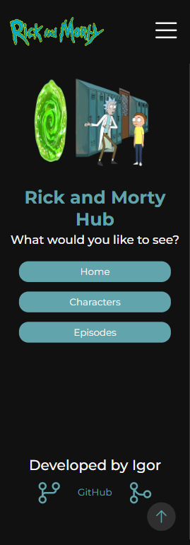
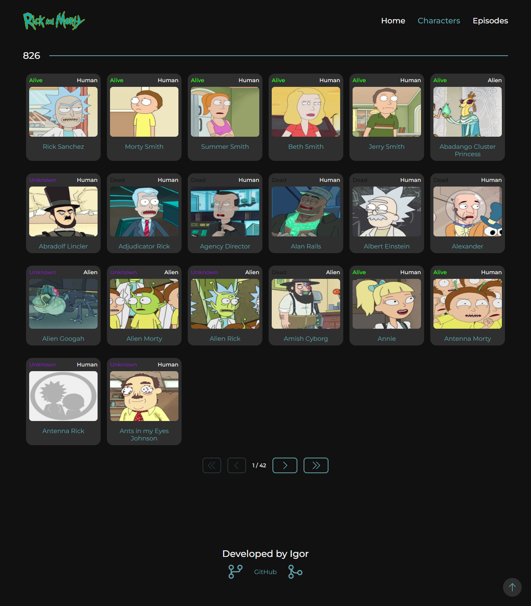
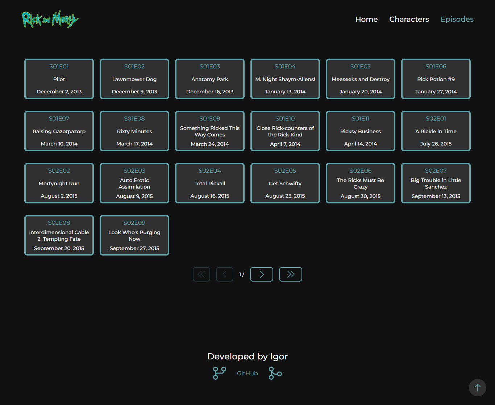

# Rick and Morty Hub

DESCRIPTION

## Images

## TECHNOLOGIES

-   React.js
-   TypeScript
-   Styled-components
-   GraphQL

## User-Focused Features

-   Scroll to top button: Navigate through the app effortlessly using a button that smoothly takes you back to the top of the page, simplifying navigation.
-   Responsive Design: Have a seamless experience across different devices with a responsive layout that adapts to various screen sizes.
-   Intuitive Navigation: We provide a simplified browsing experience through a well-designed page system.
-   Important Information: Explore complete information about Rick and Morty characters and episodes, including names, characteristics, and episode details.

## Developer-Centric Resources

-   Custom imports
-   Global state management with ContextApi
-   Code formatting with Eslint and Prettier
-   BEM architecture for styling
-   Global variables for project styling
-   Paging system with react-router-dom

## Deploy

-   [Access Rick and Morty Hub](https://rock-and-morty-hub-ig.vercel.app/)

## How to Use

-   Clone this repository to your computer
-   Install dependencies using the command: `pnpm i`
-   Start the development server with: `pnpm dev`
-   Open your browser and navigate to: `http://localhost:3000`
